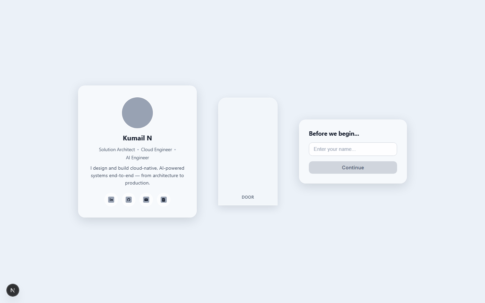
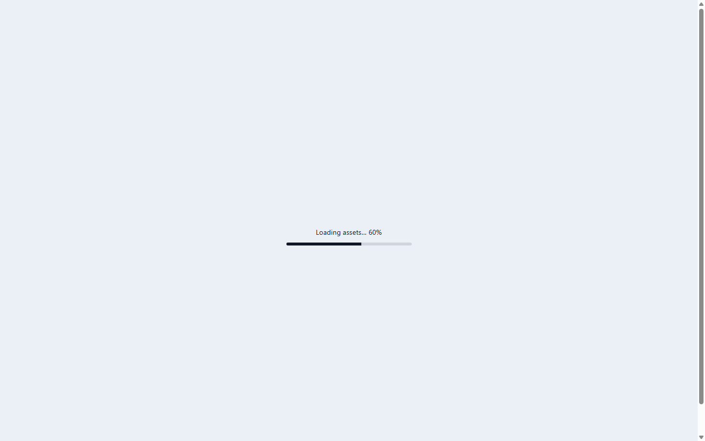

# Phase 2.2 — Asset Loading System

**Objective**: build a reusable `AssetManager` that preloads critical images before render, shows loading progress, integrates React Suspense, caches assets, lazy-loads secondary assets, and falls back to a placeholder when an asset is missing. No business logic — asset loading only.

Build status: ✅ `pnpm build` compiles clean; route `/` still prerenders as static content (the manager is SSR-safe); all 18 asset URLs verified `200`.

## Files Added

### Asset scaffold — `public/assets/`

| Path | Type | Role |
| --- | --- | --- |
| `images/hero/{house,house-open,office,garden}.webp` | placeholder image | hero backgrounds (first 3 are critical, `garden` is secondary) |
| `images/avatar/kumail.png` | placeholder image | critical avatar portrait |
| `images/avatar/{kumail-talking-01,kumail-talking-02}.png` | placeholder image | secondary — lazy-loaded talking frames |
| `images/loader/{portal-glow,particles}.png` | placeholder image | secondary — lazy-loaded loader effects |
| `images/ui/logo.svg` | hand-written SVG | critical logo |
| `images/ui/fallback.svg` | hand-written SVG | shown by `AssetManager` when any image fails to load |
| `video/{greeting,idle}.mp4` | empty placeholder | reserved for future video playback |
| `audio/{welcome,door-open,ambience}.mp3` | empty placeholder | reserved for future audio playback |
| `lottie/{loader,orb,particles}.json` | minimal valid Lottie JSON | reserved for future Lottie playback (valid so `JSON.parse` never breaks on it) |

Raster placeholders (`.webp`/`.png`) were generated with `sharp`, added as a temporary devDependency and removed immediately after generation — it is not part of the permanent dependency tree.

### Engine

| File | Purpose |
| --- | --- |
| `src/engine/managers/AssetManager.ts` | Core class + singleton (`assetManager`). Preloading, caching, progress tracking, fallback-on-error, Suspense resource, lazy secondary preloading |
| `src/engine/managers/assetManifest.ts` | `CRITICAL_IMAGES` (5 files preloaded before render) and `SECONDARY_IMAGES` (lazy) constants, plus `FALLBACK_IMAGE` path |

### Hooks

| File | Purpose |
| --- | --- |
| `src/hooks/useAssetProgress.ts` | `useSyncExternalStore` hook subscribing to `assetManager`'s progress store |

### UI components

| File | Purpose |
| --- | --- |
| `src/components/ui/AssetPreloader/AssetPreloader.tsx` | `<Suspense>` boundary; gates children on the critical-assets resource, then kicks off secondary preloading |
| `src/components/ui/AssetLoadingProgress/AssetLoadingProgress.tsx` | Suspense fallback UI — renders "Loading assets… N%" and a progress bar |
| `src/components/ui/AssetLoadingProgress/AssetLoadingProgress.module.css` | Styling for the progress UI (CSS Modules, one CSS custom property for dynamic width) |

## Files Modified

| File | Change |
| --- | --- |
| `src/engine/managers/index.ts` | Added `export * from "./AssetManager"` and `"./assetManifest"` to the barrel |
| `src/app/page.tsx` | Wrapped `<LandingScene />` in `<AssetPreloader>` — the real entry point where preloading now happens |

## Architecture

```
src/app/page.tsx
  └── AssetPreloader                       ("use client", Suspense boundary)
        ├── fallback: AssetLoadingProgress  (subscribes to assetManager progress)
        └── CriticalAssetsGate
              ├── assetManager.getCriticalResource().read()   ← suspends until resolved
              ├── useEffect → assetManager.preloadSecondary() ← fires once, non-blocking
              └── children: LandingScene (unchanged, still a server component)
```

Key mechanics inside `AssetManager`:

- **Cache** — a `Map<string, AssetRecord>` keyed by URL; `preload(src)` returns the cached promise on repeat calls instead of re-fetching.
- **Preload + progress** — `preloadAll(sources)` sets `totalCount`/`loadedCount`, resolves each source in parallel via `Promise.all`, and calls `emitProgress()` after each settles. `useAssetProgress` (via `useSyncExternalStore`) re-renders `AssetLoadingProgress` on every emission.
- **Suspense integration** — `getCriticalResource()` wraps the `preloadAll` promise in the classic "render-as-you-fetch" resource (`wrapPromise`): `.read()` throws the pending promise the first time (Suspense shows the fallback), and returns immediately once resolved.
- **Fallback on missing asset** — `loadImage`'s `image.onerror` swaps in `FALLBACK_IMAGE` (`fallback.svg`) and resolves rather than rejects, so one broken asset never breaks the preload gate or throws to an error boundary.
- **SSR safety** — every browser-only code path is guarded by `isBrowser = typeof window !== "undefined"`. During Next's static generation, `loadImage` short-circuits to an immediately-resolved stub and `getCriticalResource()` returns a resource that never suspends — confirmed by `/` still being listed as `○ (Static) prerendered as static content` after this change.
- **Lazy secondary loading** — `preloadSecondary(sources)` defers via `requestIdleCallback` (falling back to `setTimeout(200ms)` where unsupported) so `garden.webp`, the avatar talking frames, and the loader effects warm the cache in the background without delaying first render.

## Components

| Component | Type | Responsibility |
| --- | --- | --- |
| `AssetManager` (class, singleton) | plain TS | preload, cache, progress, fallback, Suspense resource — the whole system lives here |
| `AssetPreloader` | client component | the reusable Suspense boundary + gate; wrap any subtree that needs critical assets ready first |
| `AssetLoadingProgress` | client component | generic progress UI, usable as a Suspense `fallback` anywhere |
| `useAssetProgress` | hook | thin `useSyncExternalStore` wrapper so any component can read live progress |

## Notes

- Scope was kept to **asset loading only** — no door/AI/business logic was touched; `CriticalAssetsGate` does nothing but call `.read()` and schedule secondary preloading.
- Because local dev-server assets resolve in a few milliseconds, the loading-progress fallback is not visible in a normal screenshot of the running app — it renders and unmounts within a single frame. The mechanism itself (Suspense throw → progress store updates → swap to content) was verified by code path and by the successful static build; a mockup of the fallback UI's appearance is included below for reference.
- Two files exist beyond the last-given asset tree (`kumail-talking-01/02.png`, `fallback.svg`) — kept intentionally, as they're referenced by `SECONDARY_IMAGES` and the fallback path respectively.
- All 18 asset URLs (5 critical + 13 secondary/reserved) return `200` from the dev server.

## Screenshots

Landing page after the critical-asset gate resolves (visually unchanged from Sprint 2.2 — confirms no regression):



Loading-progress fallback appearance (static mockup of `AssetLoadingProgress`, since real preloads complete too fast locally to capture live):


