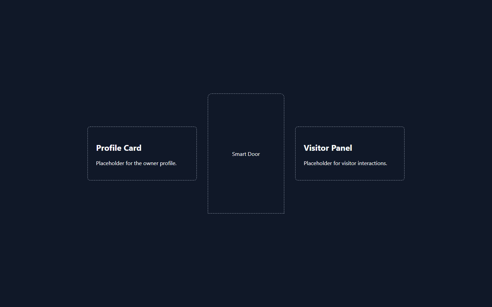
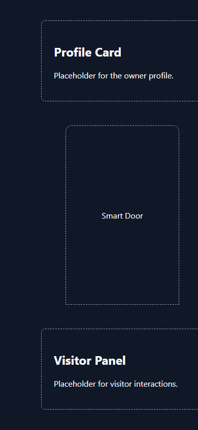

# Sprint 2.1

**Landing Scene Skeleton** — 2026-07-06

Goal: create the LandingScene as the default route with a responsive full-screen layout, split into placeholder components. No images, no heavy styling, no animation.

Build status: ✅ `pnpm build` compiles successfully, type-check clean, `/` prerendered as static content.

## Files Added

### Landing feature components

| File | Purpose |
| --- | --- |
| `src/features/landing/components/LandingLayout/index.tsx` | Full-viewport `<main>` wrapper (`position: relative`, `min-height: 100dvh`) |
| `src/features/landing/components/Background/index.tsx` | Solid-color background layer (`position: absolute; inset: 0`), no images |
| `src/features/landing/components/ProfileCard/index.tsx` | Placeholder card for the owner profile |
| `src/features/landing/components/VisitorPanel/index.tsx` | Placeholder card for visitor interactions |
| `src/features/landing/components/SmartDoor/index.tsx` | Door-shaped placeholder (rounded-top rectangle) |
| `src/features/landing/components/index.ts` | Barrel re-exporting all five components |

### Tooling / generated

| File | Purpose |
| --- | --- |
| `pnpm-lock.yaml` | Lockfile from first dependency install |
| `next-env.d.ts` | Generated by Next.js (TypeScript ambient types) |

## Files Modified

| File | Change |
| --- | --- |
| `package.json` | Added dependencies (`next@15`, `react@19`, `react-dom@19`, `typescript@5.9`, type packages) and `dev` / `build` / `start` / `typecheck` scripts |
| `tsconfig.json` | Auto-reconfigured by Next.js on first build (`noEmit`, `incremental`, `allowJs`, Next plugin, `.next/types` include) |
| `src/app/layout.tsx` | Implemented root layout with metadata and `globals.css` import |
| `src/app/page.tsx` | Implemented default route — renders `<LandingScene />` |
| `src/app/globals.css` | Minimal reset (`box-sizing`, zero margins, system font stack) |
| `src/app/loading.tsx` | Minimal default export (required valid component) |
| `src/app/not-found.tsx` | Minimal centered 404 placeholder |
| `src/scenes/LandingScene/index.tsx` | Implemented scene composition (see Architecture) |
| `src/engine/managers/{Audio,Avatar,Camera,Scene}Manager.ts` | Empty stubs → placeholder classes (`export class XManager {}`) so the barrel `export *` compiles |
| All remaining empty `.ts` / `.tsx` stubs (config, constants, hooks, stores, types, other scenes) | Empty files → `export {};` — required because `isolatedModules` rejects files that are not modules |

## Architecture

Render flow for the default route:

```
src/app/page.tsx            (App Router route "/", default export)
  └── src/scenes/LandingScene/index.tsx        (scene composition)
        └── src/features/landing/components/   (feature components via barrel)
              ├── LandingLayout   — full-screen wrapper
              ├── Background      — absolute layer behind content (z-index 0)
              └── content row (z-index 1, flex, wraps on small screens)
                    ├── ProfileCard
                    ├── SmartDoor
                    └── VisitorPanel
```

Conventions followed:

- **App Router** — the route lives in `src/app/`, scene logic lives outside it.
- **Scene → feature split** — the scene composes; the feature owns its components.
- **Absolute imports** — all cross-module imports use the `@/*` alias (`@/scenes/LandingScene`, `@/features/landing/components`).
- **Barrel exports** — components are consumed through `src/features/landing/components/index.ts`.
- **Responsiveness** — flex with `flex-wrap` and `min()`-based widths; cards stack vertically on narrow viewports, no media queries needed at this stage.

## Components

| Component | Renders | Notes |
| --- | --- | --- |
| `LandingLayout` | `<main>` covering the full viewport | Accepts `children`; `overflow: hidden` for future animation layers |
| `Background` | Solid dark layer (`#101828`) | `aria-hidden`; will later hold imagery/3D |
| `ProfileCard` | Dashed-border card with heading + text | `aria-label="Profile card"` |
| `SmartDoor` | Door-shaped dashed outline, centered label | Rounded top corners; future entry point to the office |
| `VisitorPanel` | Dashed-border card with heading + text | `aria-label="Visitor panel"` |

All components are server components (no `"use client"` needed yet — no state, no handlers), render placeholder content only, and use light inline styles.

## Notes

- The repo had no dependencies before this sprint; bootstrapping Next.js/React/TypeScript was a prerequisite for "output should compile successfully."
- ESLint is **not installed yet** — `next build` prints a notice and skips linting. Wiring up `eslint` + `eslint-config-next` (the root `eslint.config.js` is an empty flat config) is a candidate for the next sprint.
- No images, no animation, no heavy styling, per sprint constraints. Styling is intentionally inline and minimal; it will migrate to the design system later.
- Verify locally with `pnpm dev` → `http://localhost:3000`.

## Screenshots

Desktop (1440×900):



Mobile (390×844) — cards stack vertically:


